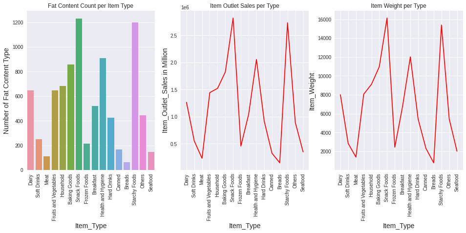
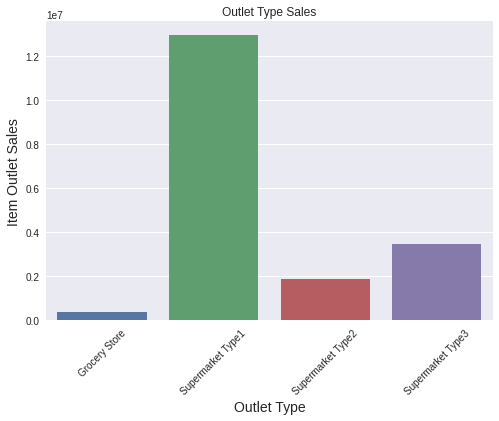

# sales-predictions

### To understand and visualize the sales predictions of a company.

#### Model Used:
  - Linear Regression Model
  - Decision Tree (Simple) Model
  - Bagged Tree Model
  - Random Forest Model

### Below visuals plot the sales of a item types with respect to Fat Content Type, Item Outlet Sales per Type, Item Weight Per Type:

### Below visuals plot the more number of sales per store types:

### Below visuals plot the train an test score of a different moduels used:

